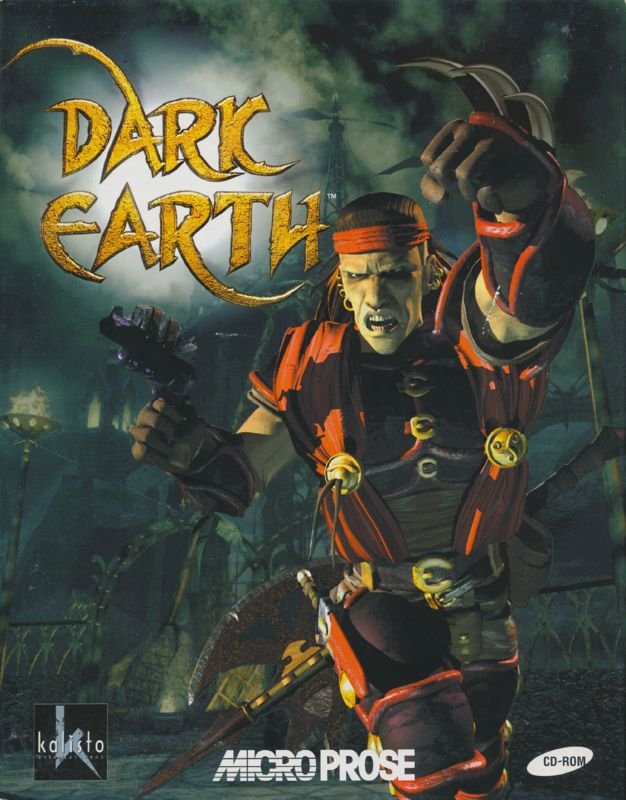

# Dark Earth 

Welcome to the Dark Earth Game Reimplementation.

The main goal of this project is to create a modern and portable engine for the Dark Earth pc game and have a clean codebase for learning purposes. Dark Earth was created by Kalisto Entertaiment in 1997 which is no longer an active business and we believe it is important to preserve the game and its universe and allow it to be played on modern systems by future generations.

Portal: https://dark-earth-game.github.io/portal

## Status

The project is in its initial stages.

We are currently working on disassembling the game and understanding the game engine and its file formats.

Check the [TODO.md](TODO.md) for more comprehensive list of upcoming features and tasks.

## How to use it

Place the contents of the game folder into the bin folder and run the executable.

## Compiling

The project tries to be cross-platform with minimal dependencies to facilitate the compilation process on different platforms. Mac OS X and Windows are the main platforms we are targeting.

## Mac OS X/Linux

> make

> make run

## Disassembly

In the disassembly folder you will find the IDA Free v8.4 project files for the game. The executable used was the patched version of the game with no CD protection.

## Authors

Refer [AUTHORS.md](AUTHORS.md) file for a full list of contributions on this project.

## Copyright

The intellectual property of Dark Earth universe is currently owned by an unknown French Film Producer, while the game was copyrighted and originaly developed by Kalisto Entertainment in 1997.

## License

Copyright (C) 2025 Dark Earth Game Community

Permission is hereby granted, free of charge, to any person obtaining a copy
of this software and associated documentation files (the "Software"), to deal
in the Software without restriction, including without limitation the rights
to use, copy, modify, merge, publish, distribute, sublicense, and/or sell
copies of the Software, and to permit persons to whom the Software is
furnished to do so, subject to the following conditions:

The above copyright notice and this permission notice shall be included in all
copies or substantial portions of the Software.

Refer [LICENSE](LICENSE) file for full license descriptions.
